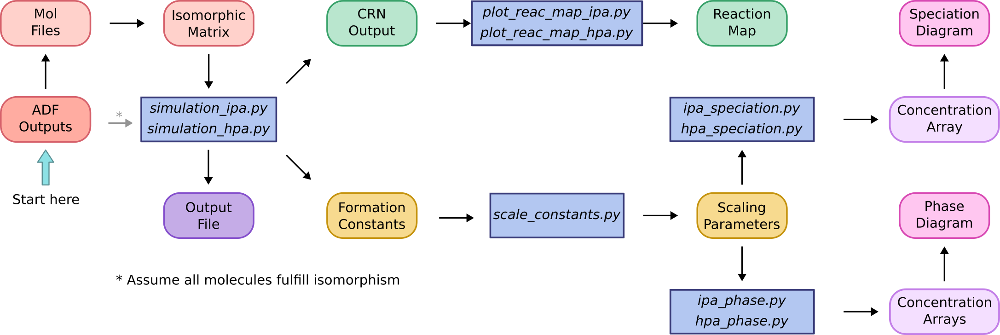

[](https://doi.org/10.1039/D0SC03530K)
[](https://github.com/petrusen/pomsimulator/releases/latest)
[](https://github.com/petrusen/pomsimulator/blob/main/LICENSE.txt)
[](https://pomsimulator.readthedocs.io/en/latest/?badge=latest)


# POMSimulator

- [Introduction](#Introduction)
- [Installation](#Installation)
- [Quickstart](#Quickstart)
- [How to Cite](#Howtocite)
- [License and Copyright Information](#licenseandcopyrightinformation) 
- [Support and Contact](#supportandcontact)

## Introduction 

POMSimulator is a software for predicting the aqueous speciation and self-assembly mechanism of polyoxometalates. Based on a pure Python framework, the method 
generates reaction maps using Graph Theory, and solves the non-linear equations related to the speciation models. The software creates a collection of formation constants for
all the species in the simulation, and a list of the chemical reactions. The package also contains a set of python scripts for analysing and
plotting this data.

**Authors**: Enric Petrus, Mireia Segado-Centellas, Carles Bo

**Institution**: research group of Carles Bo, at the Institute of Chemical Research of Catalonia (ICIQ) - Tarragona, Spain

**Developer team**: Jordi Buils, Diego Garay-Ruiz, Enric Petrus

## Installation

POMSimulator can be installed via git and pip (see below). Tested and confirmed compatibility with Python 3.8–3.12 in Ubuntu 22.04. 

```console
git clone <pomsimulator-repo>
cd pomsimulator
pip install -e . # we recommend installing it in editable mode
```

## Quickstart  

The main simulation file of POMSimulator is stored in `./simulations`. The code reads the quantum mechanical outputs in `./inputs` and generates two
output files in the folder `./outputs`. These two files correspond to the chemical reaction network, and the list predicted of formation constants. Hitherto, the code parses the input data from the calculations of the SCM ADF 2019 package. Nonetheless, the input data can also be introduced separately. 

The run the code, the user has to set the simulation.py file, and the execute it. For example: `python simulation_tungstates.py`. 

With the obtained results, the package offers a set of tools, in the folder `./utilities`, for analysing and plotting the results.
Before plotting the speciation and/or phase diagrams, it is necessary to linearly scale the predicted formation constants. This is done with 
`scale_constants.py`. The scaling parameters are stored as a text file (`scaling_params.pomsim`), and then employed by `speciation_diagram.py`.



## More Information

The user can find more information about the method in: 
1) The PhD Theses from [Enric Petrus](https://www.tesisenred.net/handle/10803/687274) and [Jordi Buils](https://www.tesisenred.net/handle/10803/693464)
2) The markdown manual in `docs/manual.md`
3) The documentation hosted at [readthedocs.org](https://pomsimulator.readthedocs.io/en/latest/?badge=latest)

## How to Cite

When publishing results generated with POMSimulator, we kindly request you to cite the original article and the article describing the open-source release of the code:

> Petrus, E.; Segado, M.; Bo, C. *Chem. Sci.*, **2020**, 11, 8448-8456 [DOI](https://doi.org/10.1039/D0SC03530K)

> Petrus, E.; Buils, J.; Garay-Ruiz, D.; Segado-Centellas, M.; Bo, C. *J. Comput. Chem.* **2024**, 45, 2242-2250 [DOI](https://doi.org/10.1002/jcc.27389)

### List of peer-reviewed articles featuring POMSimulator:
- Petrus, E.; Bo, C. *J. Phys. Chem. A.* **2021**, 125, 23, 5212-5219 [DOI](https://doi.org/10.1021/acs.jpca.1c03292)
- Petrus, E.; Segado-Centellas, M.; Bo, C. *Inorg. Chem.* **2022**, 61, 35, 13708-13718 [DOI](https://pubs.acs.org/doi/abs/10.1021/acs.inorgchem.2c00925)
- Petrus, E.; Garay-Ruiz, D.; Reiher, M.; Bo, C. *J. Am. Chem. Soc.*, **2023**, 145, 34, 18920-18930 [DOI](https://pubs.acs.org/doi/full/10.1021/jacs.3c05514)
- Garay-Ruiz, D.; Petrus, E.; Bo, C. *Revista de la Societat Catalana de Quimica* **2023**, 22, 23-38 [DOI](http://doi.org/10.2436/20.2003.01.142)
- Buils, J.; Garay-Ruiz, D.; Segado-Centellas, M.; Petrus, E.; Bo, C. *Chem. Sci.* **2024**, 15, 14218-14227 [DOI](https://doi.org/10.1039/D4SC03282A)
- Buils, J.; Garay-Ruiz, D.; Petrus, E.; Segado-Centellas, M.; Bo, C. **2025**, Digital Discovery, 4, 970-978 [DOI](https://doi.org/10.1039/D4DD00358F)

## License and Copyright Information

POMSimulator is distributed under the GNU AFFERO GENERAL PUBLIC LICENSE. For more license and copyright information, see the file `LICENSE.txt`.

## Support and Contact

In case you should encounter problems or bugs, please write a short message to one of the following addresses:  
[enricpz@icloud.com](mailto:enricpz@icloud.com), [jbuils@iciq.es](mailto:jbuils@iciq.es), [dgaray@iciq.es](mailto:dgaray@iciq.es).


