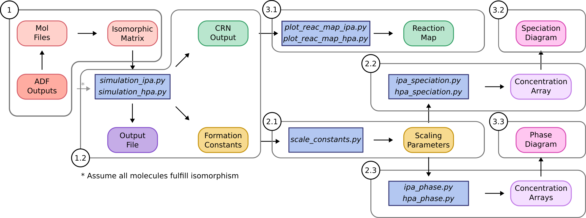
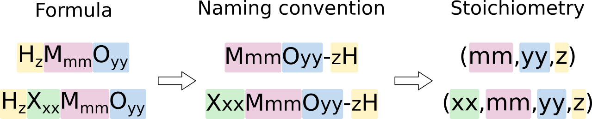
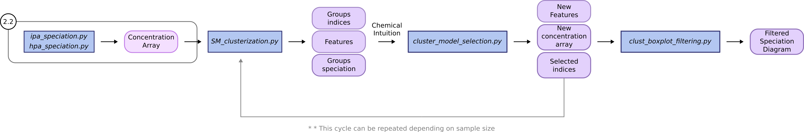
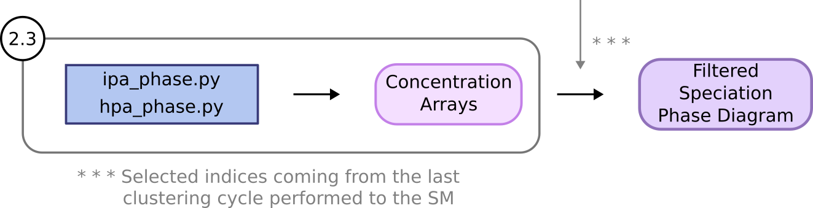

# POMSimulator: User's manual guide


Welcome to the User Manual for the POMSimulator.
This manual is designed to provide you with all the necessary information to make the most
of POMSimulator. Here, you will find detailed instructions, helpful tips, and solutions to potential issues that may arise during the use of the product.

Before you begin, we recommend reading this manual thoroughly to familiarize
yourself with the features and functions of POMSimulator. If you have any questions
or need additional assistance, feel free to contact our technical support team.

We hope you enjoy using POMSimulator, and that this guide proves to be of great help to you!
- [enricpz@icloud.com](enricpz@icloud.com)
- [jbuils@iciq.es](jbuils@iciq.es)
- [dgaray@iciq.es](dgaray@iciq.es)

Sincerely, POMSimulator Team
# Contents

- [Getting to know POMSimulator and how to run it](#getting-to-know-pomsimulator-and-how-to-run-it)
  - [1. Main Simulation - Obtaining Reaction Network & Formation Constants](#1-main-simulation---obtaining-reaction-network--formation-constants)
    - [1.1. Checking connectivity and isomorphism](#11-checking-connectivity-and-isomorphism)
    - [1.2. Running simulation](#12-running-simulation)
  - [2. Data treatment](#2-data-treatment)
    - [2.1. Scale Theoretical Constants Data](#21-scale-theoretical-constants)
    - [2.2. Chemical Speciation Data](#22-monometal_speciationpy)
    - [2.3  Chemical Speciation Phase Data](#23-chemical-speciation-phase-data)
    - [2.4 Statistical treatment of speciation models](#24-statistical-treatment)
  - [3. Visualization of Data](#3-visualization-of-data)
    - [3.1 Chemical Reaction Map](#31-plot_reac_mappy)
    - [3.2 Plot Speciation Diagram](#32-plot_speciation_diagrampy)
    - [3.3 Plot Speciation Phase Diagram](#33-plot_phase_diagrampy)

# Getting to know POMSimulator and how to run it

POMSimulator is a Python3 program designed to predict speciation diagrams
in multi-species-multi-equilibria systems for polyoxometalates in aqueous phase.  
Starting from version 2.0, all the input parameters of POMSimulator (including simulations, data treatment and plotting) are listed in a unique configuration file. In this release we provide two sample configuration files for 
[isopolyoxometalates](../inputs/config_W.pomsim) and [heteropolyoxometalates](../inputs/config_PMo.pomsim). The usage of a centralized configuration file should streamline reproducing the results of previous simulations, thus making the overall methodology more robust. 
Notice that the different molecular sets are located in the inputs folder. We strongly recommend generating a unique directory within the inputs folder, for each molecular set.
Additionally, the outputs generated for a given system are stored in a unique directory, which has to be defined before running the simulation. In this way, for each studied system there will be an output directory that will contain all the results obtained (isomorphism matrix,formation constants, system labels, concentration arrays...)

The utilities folder contains a wide array of programs for tasks such as plotting speciation diagrams, calculating linear regressions, among others. 

The `pomsimulator/modules/` folder is essential to POMSimulator, as it houses the most critical files: the [graph_module](../pomsimulator/modules/graph_module.py), [text_module](../pomsimulator/modules/text_module.py),[msce_module](../pomsimulator/modules/msce_module.py), [helper_module](../pomsimulator/modules/helper_module.py), [plotting_module](../pomsimulator/modules/plotting_module.py), [DataBase](../pomsimulator/modules/DataBase.py) and [stats_module](../pomsimulator/modules/stats_module.py). These files are responsible for the implementation of the main code, enabling the program to function properly.

The DataBase.py file contains experimental data such as formation constants and molecule labeling. There is also useful information such as the predefined reaction types (condensation, addition, protonation reactions ...) used by the msce_module.

The Graph module is essential for running the simulation, as it oversees several key functions related to the generation and applications of graphs.

The MSCE module is responsible for the resolution of the equations systems of the speciation models.

The Text module oversees functions related to input parsing and output writing. 

The Helper module contains different functions needed for the correct use of the code, as well as wrapper functions to assist in some of the program routines.

<p align="center">
    

## 1. Main Simulation - Obtaining Reaction Network & Formation Constants

To begin using POMSimulator, it is necessary to generate a set of
molecules calculated using ***ADF2019*** ( `file.out` ). The files should be named
in the following format: **MmmOyy-zH**. In case the molecular set is formed by heteropolyoxometalates, the labeling should be as follows:  **XxxMmmOyy-zH**.

<p align="center">
    
    
Here, M is the metal atom (and *mm*, its stoichiometry), O is oxygen (and *yy* its stoichiometry) and H, the hydrogen (*z*). For HPAs, X corresponds to the heteroatom (and **xx**, its stoichiometry). Under this 
convention, file names can be seamlessly transformed to stoichiometric coefficients, which are employed in multiple
steps of POMSimulator's workflow.


The second step entails placing the molecular set inside the
POMSimulator directory. The set of molecules should be placed in the
`inputs` directory.

<p align="center">


The third step requires to generate a directory inside the outputs directory, to save all the results derived from the molecular set that has just been created.

### 1.1. Checking connectivity and isomorphism

To create the molecular graphs, POMSimulator uses the atoms as nodes, and to generate the edges it relies
on Bader's connectivity. While this connectivity is well-defined for organic compounds, it
sometimes can contain artificats for metal-containing compounds, such as polyoxometalates. 

POMSimulator calculates isomorphisms between molecules before determining whether there is a 
chemical reaction between them or not. To compute the isomorphism property, the connectivity of graphs must be correct. 
For this reason, we create a .mol file for each molecule from an ADF-output file, and manually doublecheck the connectivity. After that,
 the isomorphism property for the molecular set can be computed. As a result, an isomorphism matrix will be saved as a .csv file
which will be then used in the simulation file. It is worth noting that it is possible to *skip* the isomorphism check, only considering 
stoichiometry-based criteria to generate the reaction network. Nevertheless, using the isomorphism to create the reaction network reduces the
size and complexity of the system and enhances the chemical soundness of the method.

If the isomorphism check is to be requested, the user *should* run inside the directory `utilities/` the following files:
1. ``generate_mol_file.py``: two parameters must be adjusted to the user needs: the adf .out directory
and the directory to store the generated .mol files. Both parameters can be found in the [configuration file](../inputs/config_PMo.pomsim) in the "Preparation" section labeled as **adf_inputs_dir** and **mol_folder** respectively.

2. ``compute_isomorphism.py``: in this case, only the .mol directory must be used as an input
parameter. The result of this program is the isomorphism matrix, that will be saved as an .csv file named ``np_IM_{system}.csv`` where system would be changed to the proper tag. The isomorphism matrix is then stored in the corresponding output directory.


### 1.2. Running simulation

To run POMSimulator, the user should run the to `simulation_ipa.py` or `simulation_hpa.py`. The parameters needed to run these files are found in [configuration ipa-file](../inputs/config_W.pomsim) and [configuration hpa-file](../inputs/config_PMo.pomsim) where they can be modified to fit the users needs. The default parameters in these configuration files are defined in order to run the test molecular samples. These parameters are:

**Input/Output parameters**
- ``config_file`` : modify this according to the name of your **[configuration file](../inputs/config_PMo.pomsim)**.
- ``ADF_folder``: modify this according to the name of your **molecular set directory**.
- ``mol_folder``: modify this according to where you keep the mol files, to check **isomorphisms**.
- `output_path`: modify this according to the proper path of the results directory.

- ``isomorphism_matrix``: modify this according to the path of the isomorphic matrix generated from the isomorphism.
- ``formation_constants_file``: modify this according to the name you want to give to the **formation constants** file.
- ``CRN_file``: modify this according to the name you want to give to the file containing the **chemical reactions**.
- ``simulation_file``: modify this parameter, to name the file which will contain all the simulation details.

**Operation parameters**

- ``cores``: the number of **cores** to which the program will parallelize the resolution of speciation models.
Modify this parameter to fit your needs, and hardware specifications
- ``batch_size``: speciation models are solved in batches. This parameter defines **how many models** each batch
will have. Modify this parameter to fit your needs, and hardware specifications
- `sample_type`: modify this parameter according to the type of sample to perform. Two options are available in this parameter: "all" or "random"."all" option consists on calculating the totality of Speciation Models while the "Random" option consists on applying a random sampling to the totality of generated SMs.
- `sample_perc`: modify this parameter according to the size of the sample to calculate. This parameter is only called when random sampling is applied.

**Chemical parameters**


The number of speciation models grows factorially as function of the number of reactions and molecules. To constrain the factorial growth, some chemical constrains can be applied. The most basics ones
can be modified from the parameters section. These are: 

- ``use_isomorphism``: modify this boolean value to fit whether User want to apply **isomorphism** or not
- `energy_threshold`: only reactions with energies below this number (in kcal/mol) will be considered.
- `proton_numb`: species can be found in different protonation states, but only species with similar protonation states can be found in the same pH ranges. proton_numb refers to the maximum difference in proton number between
different species.
- `I`(Ionic strength): modify this parameter according to the desired ionic strength.
- `C0`: modify this parameter according to the desired initial concentration for the reference compound/s.
- `temp`: modify this parameter according to the desired temperature.
- `min_pH`.`max_pH`,`step_pH`: modify these parameters according to the desired pH grid.
- `ref_compounds`: modify this parameter to set the reference compounds for the simulation. Note that for IPA systems, only one reference compound is expected, while for HPA systems two compounds are expected.

The user needs to select which reactions to include in the simulation.
This is achieved by modifying the ``reference`` variable. A brief definition of all the possible
reaction types and how they are located is summarised in the following table:


| Reaction type | Full name             | Description                                                                                      | Stoich diff.<br/>( P - R )<br/> [xM,yO,zH] | 
|:-------------:|-----------------------|--------------------------------------------------------------------------------------------------|--------------------------------------------| 
|       P       | Protonation           | R<sub>1</sub> + H<sup>+</sup> &rarr; P                                                           | [0,0,1]                                    | 
|     H2Ow1     | 1 water Hydration     | R<sub>1</sub> + H<sub>2</sub>O &rarr; P                                                          | [0,1,2]                                    | 
|     H2Ow2     | 2 water Hydration     | R<sub>1</sub> + 2 H<sub>2</sub>O &rarr; P                                                        | [0,2,4]                                    | 
|      Cw1      | 1 water Condensation  | R<sub>1</sub> + R<sub>2</sub> &rarr; P + H<sub>2</sub>O                                          | [0,-1,-2]                                  | 
|      Cw2      | 2 water Condensation  | R<sub>1</sub> + R<sub>2</sub> &rarr; P + 2 H<sub>2</sub>O                                        | [0,-2,-4]                                  | 
|      Cw3      | 3 water Condensation  | R<sub>1</sub> + R<sub>2</sub> &rarr; P + 3 H<sub>2</sub>O                                        | [0,-3,-6]                                  | 
|      Cw4      | 4 water Condensation  | R<sub>1</sub> + R<sub>2</sub> &rarr; P + 4 H<sub>2</sub>O                                        | [0,-4,-8]                                  | 
|     Cw10      | 10 water Condensation | R<sub>1</sub> + R<sub>2</sub> &rarr; P + 10 H<sub>2</sub>O                                       | [0,-10,-20]                                | 
|       A       | Addition              | R<sub>1</sub> + R<sub>2</sub> &rarr; P                                                           | [0,0,0]                                    | 
|      HO       | Hydroxylation         | R<sub>1</sub> + H<sub>6</sub>O<sub>3</sub> &rarr; P +  [H<sub>5</sub>O<sub>2</sub>] <sup>+</sup> | [0,1,1]                                    | 
|      H3O      | Acid Hydrolysis       | R<sub>1</sub> + H<sub>3</sub>O<sup>+</sup>  &rarr; P                                             | [0,1,3]                                    | 

Other parameters can be modified according to the studied system in the ``InternalConditions`` section of the [configuration file](../inputs/config_PMo.pomsim).
These parameters are contained in a special section tagged as Internal Parameters, but they are **not meant to be modified routinely**:
- ``restrain_addition``: This parameter restrains addition reactions, only allowing these where one of the reagents has as many (or less) atoms as marked by this parameter (e.g., if set to 1, only additions where one reagent is a monomer). An integer value is expected.
- ``restrain_condensations``: This parameter restrains condensation reactions, only allowing these where one of the reagents has as many (or less) atoms as marked by this parameter (e.g., if set to 1, only condensations where one reagent is a monomer). An integer value is expected.
- ``include_dimerization``: This parameter allows dimerization reactions to occur, even if additions and/or condensations have been restricted. A boolean ``True`` or ``False`` is expected.
- ``force_stoich``: This parameter allows reactions that generate species with a certain number of metal atoms, even if they do not fulfill any of the previous conditions. A list of integer values is expected.
- ``adjust_protons_hydration``: This parameter takes into account the number of protons present in water molecules in hydrated species. If True, these will be ignored them when computing proton balance, to fulfill `proton_numb` condition.

Once the parameters fit the user's needs, the simulation is ready to run. Once all the speciation models have
been calculated, the simulation will write the output file, containing all the formation constants for all the
speciation models. This file will be named according to the ``Output_File`` parameter mentioned above. Also, a file
with all the parameters used in the simulation will be written named as `simulation_parameters.txt`. 

**IMPORTANT NOTE :** These simulation parameters are key to constrain the factorial growth of the number of models. If the
reactions are not restrained with chemical hypothesis, it would become impossible to calculate the formation constants of all speciation
models. For reference, a 28-core CPU struggles to calculate more than ~10<sup>8</sup> speciation models. 

After properly checking all simulation parameters described in this section, the user can run the simulation by typing `python simulation_hpa.py` or `python simulation_ipa.py` depending on the type of system under study.

Once the simulation file is executed, different files are obtained. Name and path of these files should be modified in the corresponding section of the [configuration file](../inputs/config_PMo.pomsim). The obtained files are the following:

- `logkf_{system}.csv`: file containing the calculated formation constants for the studied molecular set. A formation constants is calculated for each species in each speciation model.
- `{system}_CRN.txt`: file containing the defined reactions within the molecular set.
- `simulation_parameters.txt`: output file from the simulation, containing the parameters used.
- `labels_{system}.txt`: file containing the labels for all the species present in the molecular set.

## 2. Data treatment

The next step involves interpreting the calculated data. The obtained formations constants are overestimated when compared to the experimental values, for this reason, a linear scaling is necessary. 

In `pomsimulator/modules/DataBase.py`, experimental formation constants are stored as Python dictionaries. To compare experimental constants to those calculated, you must write the experimental data inside a dictionary. In general, POMSimulator works with logarithmic units, assuming that all concentrations used to compute the constant are in mol/L:

```python
Rosantsev_W12_I01_05I = {"W06O22-2H": 53.68, 
                         "W07O24-1H": 76.59, 
                         "W12O42-2H": 123.38, 
                         "W12O40-2H": 149.59,
                         "W10O32-0H": 129.63}
```


### 2.1. Scale Theoretical Constants Data

Once you have your data inside a dictionary, you should include the dictionary into the `experimental_constants` dictionary, so that it can be used. The user can
run the program `scale_constants.py` inside `utilities/`. This program
establishes a linear regression between experimental data and the
calculated one. Some parameters are needed to run `scale_constants.py` and can be found in the corresponding configuration file:

- `config_file`: modify this according to the system under study.
- `POM_system`: modify this parameter to the corresponding polyoxometalate system.
- `experimental_set`: modify this parameter to select the corresponding experimental constants dictionary
- `output_path`: modify this according to the proper path of the results directory.
- `lgkf_file`: modify this parameter to the corresponding lgkf file for the system under study. This file is read as a Pandas DataFrame and already contains the labels for the species in the molecular set.
- `scaling_mode`: modify this parameter to select the desired mode for the scaling of formation constants.

POMSimulator is prepared to perform the scaling of formation constants in four different ways, depending on the size the system and availability of experimental data:

- `best_rmse`: this mode corresponds to the original approach used in POMSimulator which relies on performing a linear regression for each speciation model (SM), and sort the results according to the root mean squared error (RMSE), to later select the SM with lowest RMSE value. It has been used for the prediction of the aqueous speciation of Mo, W, V, Nb and Ta isopolyoxometalates. 
  - Petrus, E.; Segado-Centellas, M.; Bo, C. Computational Prediction of Speciation Diagrams and Nucleation Mechanisms: Molecular Vanadium, Niobium, and Tantalum Oxide Nanoclusters in Solution. *Inorg. Chem.* **2022**, 61 (35), 13708–13718, [DOI: 10.1021/acs.inorgchem.2c00925](https://doi.org/10.1021/acs.inorgchem.2c00925).
  - Petrus, E.; Bo, C. Unlocking Phase Diagrams for Molybdenum and Tungsten Nanoclusters and Prediction of Their Formation Constants. *J. Phys. Chem. A* **2021**, 125 (23), 5212–5219, [DOI: 10.1021/acs.jpca.1c03292](https://doi.org/10.1021/acs.jpca.1c03292).
  - Petrus, E.; Segado, M.; Bo, C. Nucleation Mechanisms and Speciation of Metal Oxide Clusters. *Chem. Sci.* **2020**, 11 (32), 8448–8456, [DOI: 10.1039/d0sc03530k](https://doi.org/10.1039/d0sc03530k).
<p align="center">


- `average`: this scaling mode is a derivation of the previous one. A linear regression is carried out for each SM, but instead of selecting the model with lowest RMSE value, all SM scaling parameters are averaged using the mean value. This approach has been used for the prediction of the PMo heteropolyoxometalate system:
  - Buils, J.; Garay-Ruiz, D.; Segado-Centellas, M.; Petrus, E.; Bo, C. Computational Insights into Aqueous Speciation of Metal-Oxide Nanoclusters: An in-Depth Study of the Keggin Phosphomolybdate. *Chem. Sci.* **2024**, 15, 14218-14227 [DOI: 10.1039.D4SC03282A](https://doi.org/10.1039/D4SC03282A).

- `medians`: This scaling methodology is similar to the average mode. Instead of performing as many linear regressions as SMs, this scaling mode considers the formation constants across all the SMs as a boxplot, and performs a unique linear regression using the median values.
<p align="center">


- `universal`: This scaling mode consists in the application of an universal scaling equation derived from the Multi-Linear Regression model described in:
  - Buils, J.; Garay-Ruiz, D.; Petrus, E.; Segado-Centellas, M.; Bo, C. Towards a Universal Scaling Method for Predicting Equilibrium Constants of Polyoxometalates, *Digital Discovery* **2025**, 4, 970-978. [DOI: 10.1039/D4DD00358F](https://doi.org/10.1039/D4DD00358F)

  
As a result, an output file will be written, containing the scaling
parameters (``scaling_params.pomsim``). Moreover, if the scaling mode implied performing all linear regressions the scaling
parameters of each individual speciation model are included in a CSV file (``regresion_output.csv``).

### 2.2 Chemical Speciation Data

See **Section 3.2** for an example on the kind of speciation diagrams generated through POMSimulator.

Next step is to calculate the speciation of the studied system. To do this, the simulated formation constants need to be scaled, which is done by using the scaling factors determined in **Section 2.1**, stored in the corresponding `scaling_params.pomsim`.

To calculate the speciation, the user must use [ipa_speciation](../utilities/ipa_speciation.py) or [hpa_speciation](../utilities/hpa_speciation.py) depending on the system. Both work in the same way, with little differences coming from the presence of the heteroatom.

As usual, we first need to define some parameters related to the speciation which can be found in the corresponding [configuration file](../inputs/config_PMo.pomsim):

- `config_file`: modify this according to the desired [configuration file](../inputs/config_PMo.pomsim) for the system under study.
- `POM_system`: modify this parameter to the corresponding polyoxometalate system.
- `output_path`: modify this according to the proper path of the results directory.
- ``speciation_labels``: it is possible to use only a subset of species to compute the speciation, e.g. leaving out species that are known 
not to be important along the pH range of interest. User must define which labels wants to use to calculate the speciation. If all species are to be considered, this keyword should be "all"
- ``ref_compound``: formation reactions are defined from 1 reference compound, usually the monomer.
Specify which compound is your reference or references (for HPA only), write its label (XxxMmmOyy-zH), as mentioned in **Section 1**
-``min_pH,max_pH,step_pH``: user must define the pH grid to which the program will solve the speciation. A minimum and maximum value have to be defined, as well as the step value. The finer the pH grid, the better the
speciation diagram.

- `C`: (for IPA only) this parameter refers to the initial concentration of the reference compound.
- `C_X` and `C_M`: (for HPA only) this parameter refers to the initial concentration of the reference compounds.

Also, we need to define some parameters related to the hardware usage:

- ``batch_size``: as for the calculation of formation constants, the speciation is also batched. Specify the size of the batch.
- `cores`: the speciation calculation is parallelized, and for this reason user must define the amount of cores to use. **Depending on the hardware capacity of the user, this parameter should not be too high!**

After defining the desired parameters, the user can run the speciation (IPA or HPA).

As a result from running either [ipa_speciation](../utilities/ipa_speciation.py) or [hpa_speciation](../utilities/hpa_speciation.py), two files are generated:

- `Array_{system}.npz`: this numpy binary file contains the speciation results for the whole set of speciation models. The data structure could be compared to cube made by different layers. Each layer corresponds to a single speciation model, and is formed by all species on one side, and al pH values to which the speciation is calculated on the other side.
- `speciation_params_{system}.txt`: output file, similar to simulation_params file from **Section 1**. Contains the parameters used to calculate the speciation.

### 2.3 Chemical Speciation Phase Data

Another important tool in the POMSimulator methodology is the generation of speciation phase diagrams. These kind of representations are very useful to study the most abundant species in the aqueous solution of polyoxometalates in a wider range of conditions. Depending on the type of system under study (IPA or HPA), the user must use [ipa_phase](../utilities/ipa_phase.py) or [hpa_phase](../utilities/hpa_phase.py)

As usual, we first need to define some parameters related to the speciation which can be found in the corresponding [configuration file](../inputs/config_PMo.pomsim) in the `speciation` section:

- `config_file`: modify this according to the desired configuration file for the system under study.
- `POM_system`: modify this parameter to the corresponding polyoxometalate system.
- `output_path`: modify this according to the proper path of the results directory.
- `phase_dir`: modify this parameter to set up the name were the `.npz` files for the phase diagram are going to be stored at.
- ``speciation_labels``: it is possible to use only a subset of species to compute the speciation, e.g. leaving out species that are known 
not to be important along the pH range of interest. User must define which labels wants to use to calculate the speciation. If all species are to be considered, this keyword should be "all"
- ``ref_compound``: formation reactions are defined from 1 reference compound, usually the monomer.
Specify which compound is your reference or references (for HPA only), write its label (XxxMmmOyy-zH), as mentioned in **Section 1**
-``min_pH,max_pH,step_pH``: user must define the pH grid to which the program will solve the speciation. A minimum and maximum value have to be defined, as well as the step value. The finer the pH grid, the better the
speciation diagram.

- `min_logC`, `max_logC` and `N_logC`: (for IPA only) this parameter refers to the grid of initial concentration for the reference compound.
- `min_Ratio`, `max_Ratio` and `N_Ratio`: (for HPA only) this parameter refers to the grid of concentration ratios for the reference compounds. It is worth mentioning that for HPA we use the concentration ration between the concentration of metal and heteroatom instead of raw concentrations. This is done to account for the concentration of both elements.

Also, we need to define some parameters related to the code:

- ``batch_size``: as for the calculation of formation constants, the speciation is also batched. Specify the size of the batch.
- `cores`: the speciation calculation is parallelized, and for this reason user must define the amount of cores to use. **Depending on the hardware capacity of the user, this parameter should not be too high!**

Last, there is a parameter called `model_subset_file` which is related to the statistical treatment implemented in:  
  - Buils, J.; Garay-Ruiz, D.; Segado-Centellas, M.; Petrus, E.; Bo, C. Computational Insights into Aqueous Speciation of Metal-Oxide Nanoclusters: An in-Depth Study of the Keggin Phosphomolybdate. *Chem. Sci.* **2024**, 10.1039.D4SC03282A. [DOI: 10.1039/D4SC03282A](https://doi.org/10.1039/D4SC03282A).

Modify this parameter only in case a subsample derived from the statistical treatment of speciation models wants to be calculated. See more in section [2.4 Statistical treatment of speciation models](#24-statistical-treatment).

After defining the desired parameters, the user can run the speciation phase (IPA or HPA).

As a result from running either `ipa_phase.py` or `hpa_phase.py`, one outputs is generated. A directory is generated which contains as many `.npz` files as the concentrations grid is defined.
- `Array_{system}.npz`: this numpy binary file contains the speciation results for the whole set of speciation models. The data structure could be compared to cube made by different layers. Each layer corresponds to a single speciation model, and is formed by all species on one side, and al pH values to which the speciation is calculated on the other side.

### 2.4 Statistical treatment of speciation models

In addition to the original methodology, since the release 2.0 of POMSimulator, a new feature to treat the results from the speciation has been implemented. The complete details of this new methodology can be accessed in the corresponding publication (https://doi.org/10.1039/D4SC03282A). In this user manual, only the parameters and configurations needed to run this new methodology are detailed. To make use of this new approach, three files are needed: 
- [SM_clusterization.py](../utilities/SM_clusterization.py)
- [cluster_model_selection.py](../utilities/cluster_model_selection.py)
- [clust_boxplot_filtering](../utilities/clust_boxplot_filtering.py)

<p align="center">
   

Again, as for the rest of the routines, all the parameters need to run the statistical pipeline are found in the corresponding configuration file. It is important to mention, that for every new clusterization process, a new configuration file is recommended instead of modifying the existing one. The first script to run is python [SM_clusterization.py](../utilities/SM_clusterization.py). The parameters for this script are the following:

- `config_file`: modify this according to the desired configuration file for the system under study.
- `POM_system`: modify this parameter to the corresponding polyoxometalate system.
- `output_path`: modify this according to the proper path of the results directory.
- `cluster_dir`: name of the directory in which clusterization results are to be saved. These results include a figure with all the generated clusters, a csv file with the indices of models classified in their corresponding cluster group number
- `npz_cluster_file`: name of the npz file containing all the speciation results.
- `features_file`: name of the file that contains the calculated features for the SMs in the npz file. If the file does not exist, it will be generated, if it does, it will be read. This file is stored in the corresponding output path, outside the clusterization results.
- `n_clusters`: number of cluster to generate.
- `normalize_feats`: boolean, determine whether normalize the calculated features or not
- `feats_list`: list of strings, with the features to calculate (height, width, pos, area)

Once the file is run, features are read/generated and later fed into the clustering algorithm (kmeans). Finally, the groups are generated and a file containing the indices, and a figure containing the aspect of the clusters are generated. The next step is the cluster selection. To do so, `cluster_model_selection.py` is needed. After looking at the previously generated figure, the user must select with which clusters to follow.
The parameters needed to run this script are the following:

- `config_file`: modify this according to the desired configuration file for the system under study.
- `POM_system`: modify this parameter to the corresponding polyoxometalate system.
- `output_path`: modify this according to the proper path of the results directory.
- `cluster_dir`: name of the directory in which clusterization results are to be saved. These results include a figure with all the generated clusters, a csv file with the indices of models classified in their corresponding cluster group number
- `npz_cluster_file`: name of the npz file containing all the speciation results.
- `sel_groups`: indices of the selected groups in the clustering process
- `features_file`: name of the file that contains the calculated features for the SMs in the npz file. If the file does not exist, it will be generated, if it does, it will be read. This file is stored in the corresponding output path, outside the clusterization results.

This script will filter the speciation models according to the selected groups. The original npz and features files will be reduced to only include the selected SMs. 

At this point of the statistical workflow described in https://doi.org/10.1039/D4SC03282A, the user can iteratively perform further clustering on the already reduced data. If that is the case, we strongly recommend to use new configuration files.

Once the clustering stage is finished, the final step is the refinement of the selected SMs. This is done by using [clust_boxplot_filtering.py](../utilities/clust_boxplot_filtering.py). This script has the following parameters:

- `config_file`: modify this according to the desired configuration file for the system under study.
- `POM_system`: modify this parameter to the corresponding polyoxometalate system.
- `output_path`: modify this according to the proper path of the results directory.
- `cluster_dir`: name of the directory in which clusterization results are to be saved. These results include a figure with all the generated clusters, a csv file with the indices of models classified in their corresponding cluster group number

Once run, the script will perform the filtering of SMs based on all the possible species in the molecular set. As a result, a figure is generated for each filtering case, and stored in a directory called `filtering`

### 2.4.1 Model selection for phase diagram

As mentioned in the previous section, the generation of the speciation phase diagram can accept a subsample of speciation models. In https://doi.org/10.1039/D4SC03282A we compute the speciation phase diagram using the models selected in the first clustering step. The user can select what suits better.

<p align="center">
    

## 3. Visualization of data

After POMSimulator has run its simulation in **section 1**, and then treated this information in
**section 2**, we can now visualize the results. For this purpose we have different programs, located in the 
`utilities/` directory.

1. [plot_reac_map.py](../utilities/plot_reac_map_ipa.py) : with this program user can visualitze the chemical reaction network in a 2D or 3D map
2. [plot_speciation_diagram.py](../utilities/plot_speciation_diagram.py): this program plots the calculated
concentrations in `monometal_speciation.py`
3. [plot_phase_diagram_ipa.py](../utilities/plot_phase_diagram_ipa.py): this program plots the calculated concentrations in `ipa_phase.py`.
[plot_phase_diagram_hpa.py](../utilities/plot_phase_diagram_hpa.py): this program plots the calculated concentrations in `hpa_phase.py`. 


### 3.1 Chemical Reaction Network 

Through this program, we can plot the chemical reaction network. We will need to
pass the same parameters as in the simulation file, to reproduce the exact system.
User can then choose between a 2D or 3D plot and whether all reactions are included
or only the reactions in a particular speciation model. Inside `utilities/`:

``plot_reac_map_ipa.py`` and ``plot_reac_map_hpa.py``

Moreover some parameters of the plot can be tuned, from the plotting_dict. Some
of these parameters are:
- ``node_color``
- ``x_axis, y_axis and z_axis labels``
- ``plot_title``
- ``colormap``

<p align="center">


When the plot function is called, user must choose between ``Reaction_Map_2D_monometal
or Reaction_Map_3D_monometal``. User, also has to choose which reactions are plotted.
If user only selects a single speciation model, the `All_models` flag must be set to ``False`` and
the proper reactions must be passed (idx_new,e_new and type_new). Otherwise, ``All_models`` flag
must be set to ``True`` and the reactions passed must be ``Reac_idx,Reac_energy and Reac_type``. 
To select a particular speciation model, the `target_model` variable must be changed into the specific model number,
which can be extracted from the **scale_constants** output file.

### 3.2 Plot Speciation Diagram

To plot speciation diagrams, only needed the concentration
array calculated in ``monometal_speciation.py`` is needed. As a result, a plot like the
following one can be obtained running `plot_speciation_diagram.py` inside `utilities/` :
<p align="center">


The `Speciation` section of the configuration file includes a `m_idx` parameter, which selects the species for which molar fractions/percentages are computed to get the speciation plot. For IPAs, this value will be **0**, targetting the unique metal atom. For HPAs (XxxMmmOoo-hhH), we have:
- `m_idx = 0`: molar fractions for the heteroatom (X). 
- `m_idx = 1`: molar fractions for the metal atom (M). 

### 3.3 Plot Speciation Phase Diagram

#### IPA systems:

As in previous section, to plot phase diagrams, only the concentrations array computed at different values of the total concentration, generated by ``ipa_phase.py`` is needed.
As a result of running `plot_phase_diagram_ipa.py` inside `utilities/`, a plot like the following one can be obtained:

<p align="center">


#### HPA systems
The procedure is the same, using ``hpa_phase.py`` for the calculation and ``plot_phase_diagram_hpa`` for the plotting. In this case, the variable in the Y-axis of the phase diagram is not the logarithmic concentration of the metal, but the X/M ratio instead.