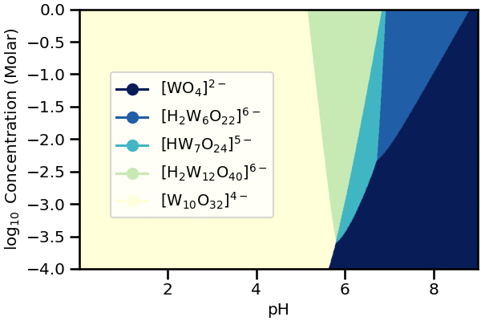

Data interpretation
====================

In this section we show the three main scripts in the `/utilities` folder that can be employed to represent the results generated by POMSimulator.

Chemical reaction network
--------------------------

The user can visualize the chemical reaction network in a 2D or 3D map running the ``plot_reac_map.py`` file. When the plot function is called, user must choose
between ``Reaction_Map_2D_monometal`` or ``Reaction_Map_3D_monometal``. The user also has to choose which reactions are plotted.
If user only selects a single speciation model, the `All_models` flag must be set to ``False`` and
the proper reactions must be passed (idx_new,e_new and type_new). Otherwise, ``All_models`` flag
must be set to ``True`` and the reactions passed must be ``Reac_idx,Reac_energy and Reac_type``.
To select a particular speciation model, the `target_model` variable must be changed into the specific model number,
which can be extracted from the **scale_constants** output file.

.. image:: ../.img/Reac_map_test.png
   :width: 400
   :alt: drawing
   :align: center

|

Speciation diagram
--------------------------

``plot_speciation_diagram.py``. To plot speciation diagrams, only needed the concentration
array calculated in ``monometal_speciation.py`` is needed. As a result, a plot like the following one can be obtained running `plot_speciation_diagram.py` inside `/utilities` :

.. image:: ../.img/Speciation_diagram_W.png
   :width: 400
   :alt: drawing
   :align: center

|

Speciation phase diagram
--------------------------

The user can plot the previously calculated concentrations by running the  ``plot_phase_diagram.py``. As in previous section, to plot phase diagrams, only the concentrations array computed at different values of the total concentration, generated by ``monometal_phase.py`` is needed.
As a result of running `plot_phase_diagram.py` inside `/utilities`, a plot like the following one can be obtained:

