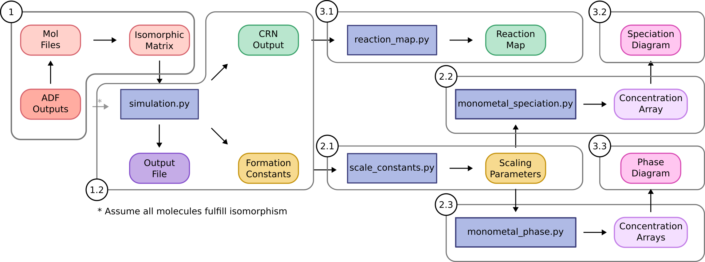

Introduction
============

Workflow
---------

Herein, we describe how the package is organized to aid potential users applying POMSimulator to their own systems.
It is worth highlighting that we have designed the code in a modular way, therefore users can easily employ separate parts
of the workflow without needing to rewrite the source code. More precisely, the method is divided in three main sections:

1. **Simulation**: this is the core of POMSimulator methodology as it generates the reaction network and calculates the formation
constants for all the metal-oxo clusters considered in the molecular set.

2. **Linear scaling**: we found that the calculated formation constants were systematically overestimated respect to the experimental ones, thus
this part of the method aims at correcting this error.

3. **Data interpretation**: we provide a set of scripts to represent the formation constants in speciation (and phase)
diagrams, as well as the chemical reaction network.

|

|

Folder hierarchy
-----------------

In terms of folder organization, the packages is split in six folders:

- The **/docs** folder contains a markdown manual and the compiled data to build this readthedocs documentation.
- The **/input** folder is where the set of molecules is stored with a directory for each molecular set.
- The **/output**  folder stores all files generated by POMSimulator.
- The **/pomsimulator/modules/** folder contains all the functions that the code uses to either run the simulation or interpret the results: the `graph_module`, `text_module`, and `msce_module`, `DataBase`, `plotting_module` and `stats_module`.
- The **/simulations** folder contains two different model files for running the simulations. The user should modify one of these files to the particular case.
- The **/utilities** folder gathers a set of scripts that are meant for processing and representing the data obtained from the simulations.

