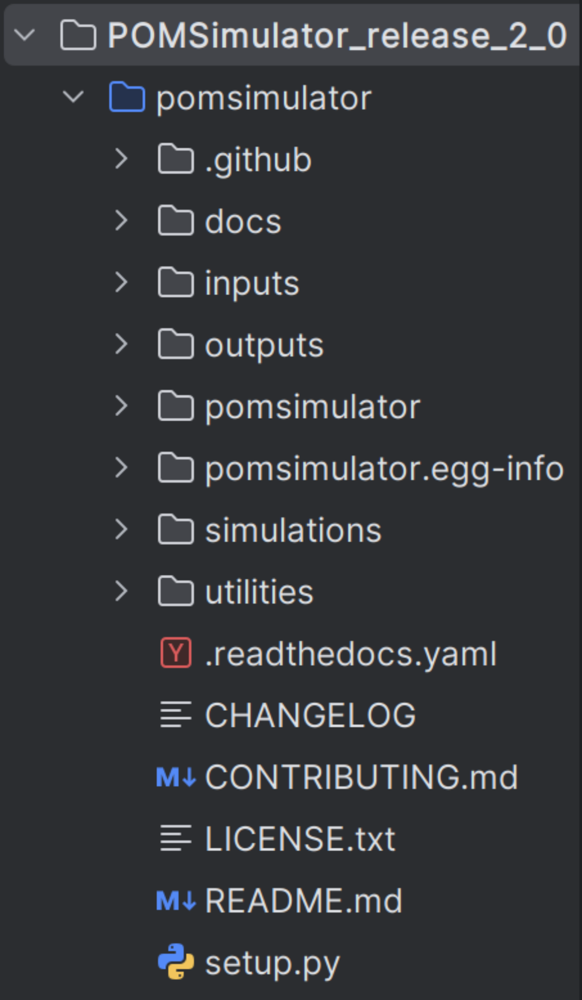

Introduction
============

``in construction``

POMSimulator is a Python3 program designed to predict the aqueous speciation and self-assembly mechanisms of polyoxometalates
. The **input** folder is where the set of molecules is stored, with a directory for each molecular set. The **output**  folder stores all files
generated by POMSimulator, while the **utilities** folder contains a wide array of programs for tasks such as plotting speciation diagrams,
calculating linear regressions among others. The **pomsimulator/modules/** folder is essential to POMSimulator, as it houses the
most critical files: the `graph_module`, `text_module`, and `msce_module`, `DataBase`, `plotting_module` and `stats_module`.
These files are responsible for the implementation of the main code, enabling the program to function properly. The DataBase.py file contains different
experimental data such as formation constants or molecule labeling. There is also usefull information such as the predefined reaction
types used by the msce_module.

.. important::
   The Graph module oversees several key functions related to the generation and applications of graphs. The MSCE module is responsible
   for the resolution of the equations systems of the speciation models. The Text module controls functions related to input parsing and output writing.

The image below shows an overview of the workflow of POMSimulator, indicating the most important parts and processes:

.. image:: ../.img/pom_workflow_manual.png
   :alt: drawing
   :width: 1000
   :align: center

Simulation File
----------------

To begin using POMSimulator, it is necessary to generate a set of
molecules calculated using ***ADF2019*** ( `file.out` ).

.. note:: So far, POMSimulator has only been employed with the Amsterdam Density Functional. Even so, we are confident that other packages such as ORCA, Gaussian or MOLCAS can also be coupled to the method, since only relative energies are considered for the simulation.

The files should be named in the following format: **MxxOyy-zH**.

.. image:: ../.img/scheme_naming.png
   :alt: drawing
   :width: 350
   :align: center

Here, M is the metal atom (and *xx*, its stoichiometry), O is oxygen (and *yy* its stoichiometry) and H, the hydrogen (*z*). Under this
convention, file names can be seamlessly transformed to stoichiometric coefficients, which are employed in multiple
steps of POMSimulator's workflow. The second step entails placing the molecular set inside the
POMSimulator directory. The set of molecules should be placed in the `inputs` directory.

To create the molecular graphs, POMSimulator uses the atoms as nodes, and to generate the edges it relies
on Bader's connectivity. While this connectivity is well-defined for organic compounds, it sometimes can be wrong with metal complexes.
POMSimulator can calculate isomorphisms between molecules before determining whether there might be a chemical reaction
between them or not. To compute the isomorphism property, the connectivity of graphs must be correct.
For this reason, we create a .mol file for each molecule from an ADF .out file and manually check the connectivity. After that,
the isomorphism property for the molecular set can be computed. As a result, an isomorphism matrix will be saved as an .csv file
which will be then used in the simulation file. It is worth noting that it is possible to *skip* the isomorphism check, only considering
stoichiometry-based criteria to generate the reaction network. Nevertheless, enforcing isomorphism both reduces the
size and complexity of the system and enhances the chemical soundness of the method.

If the isomorphism check is requested, inside the directory `utilities/` the user should run:
1. ``generate_mol_file.py``: Two parameters must be adjusted to the user needs: the adf .out directory
and the directory to store the generated .mol files.
2. ``compute_isomorphism.py``: In this case, only the .mol directory must be used as an input
parameter. The result of this program is the isomorphism matrix, that will be saved as an .csv file named ``np_IM.csv``

After these two programs have been run, the user can now run the simulations. To run POMSimulator it is recommended to initially run
the `simulation_test.py` in the `Simulations/` directory to check that the program has been installed properly. Afterwards, still inside `Simulations/`
you can move to `simulation_tungstates.py`. In this file, some parameters can be modified according to the user's needs.

- ``ADF_folder``: Modify this according to the name of your **molecular set directory**.
- ``mol_folder``: Modify this according to where you keep the mol files, to check **isomorphisms**.
- ``isomorphism_matrix``: Modify this according to the path of the isomorphic matrix generated from the isomorphism.
- ``formation_constants_file``: Modify this according to the name you want to give to the **formation constants** file.
- ``CRN_file``: Modify this according to the name you want to give to the file containing the **chemical reactions**.
- ``simulation_file``: Modify this parameter, to name the file which will contain all the simulation details.
- ``use_isomorphism``: Modify this boolean value to fit whether User want to apply **isomorphism** or not
- ``cores``: The number of **cores** to which the program will parallelize the resolution of speciation models.
Modify this parameter to fit your needs, and hardware specifications
- ``batch_size``: Speciation models are solved in batches. This parameter defines **how many models** each batch
will have. Modify this parameter to fit your needs, and hardware specifications

The number of speciation models grows factorially, depending on the number of reactions and the number
of species. To constrain the factorial growth, some chemical constrains can be applied. The most basics ones
can be modified from the parameters section. These are:
- `energy_threshold`: Only reactions with energies below this number (in kcal/mol) will be considered.
- `proton_numb`: Species can be found in different protonation states, but only species with similar protonation
states can be found in the same pH ranges. proton_numb refers to the maximum difference in proton number between
different species.

Secondly, the user needs to select which reactions to include in the simulation.
This is achieved by modifying the ``reference`` variable. A brief definition of all the possible
reaction types and how they are located is summarised in the following table:

.. list-table::
   :header-rows: 1
   :widths: 10 20 70 20

   * - Reaction type
     - Full name
     - Description
     - Stoich diff.
       ( P - R ) [xM,yO,zH]
   * - P
     - Protonation
     - R\ :sub:`1` + H\ :sup:`+` → P
     - [0,0,1]
   * - H2Ow1
     - 1 water Hydration
     - R\ :sub:`1` + H\ :sub:`2`\ O → P
     - [0,1,2]
   * - H2Ow2
     - 2 water Hydration
     - R\ :sub:`1` + 2 H\ :sub:`2`\ O → P
     - [0,2,4]
   * - Cw1
     - 1 water Condensation
     - R\ :sub:`1` + R\ :sub:`2` → P + H\ :sub:`2`\ O
     - [0,-1,-2]
   * - Cw2
     - 2 water Condensation
     - R\ :sub:`1` + R\ :sub:`2` → P + 2 H\ :sub:`2`\ O
     - [0,-2,-4]
   * - Cw3
     - 3 water Condensation
     - R\ :sub:`1` + R\ :sub:`2` → P + 3 H\ :sub:`2`\ O
     - [0,-3,-6]
   * - Cw4
     - 4 water Condensation
     - R\ :sub:`1` + R\ :sub:`2` → P + 4 H\ :sub:`2`\ O
     - [0,-4,-8]
   * - Cw10
     - 10 water Condensation
     - R\ :sub:`1` + R\ :sub:`2` → P + 10 H\ :sub:`2`\ O
     - [0,-10,-20]
   * - A
     - Addition
     - R\ :sub:`1` + R\ :sub:`2` → P
     - [0,0,0]
   * - HO
     - Hydroxylation
     - R\ :sub:`1` + H\ :sub:`6`\ O\ :sub:`3` → P +  [H\ :sub:`5`\ O\ :sub:`2`]\ :sup:`+`
     - [0,1,1]
   * - H3O
     - Acid Hydrolysis
     - R\ :sub:`1` + H\ :sub:`3`\ O\ :sup:`+` → P
     - [0,1,3]

Other parameters can be modified according to the studied system in the ``conditions_dict``.
These parameters are not meant to be modified routinely. These parameters are contained in a special section
tagged as Internal Parameters:
- ``restrain_addition``: This parameter restrains addition reactions, only allowing these where one of the reagents has as many (or less) atoms as marked by this parameter (e.g., if set to 1, only additions where one reagent is a monomer). An integer value is expected.
- ``restrain_condensations``: This parameter restrains condensation reactions, only allowing these where one of the reagents has as many (or less) atoms as marked by this parameter (e.g., if set to 1, only condensations where one reagent is a monomer). An integer value is expected.
- ``include_dimerization``: This parameter allows dimerization reactions to occur, even if additions and/or condensations have been restricted. A boolean ``True`` or ``False`` is expected.
- ``force_stoich``: This parameter allows reactions that generate species with a certain number of metal atoms, even if they do not fulfill any of the previous conditions. A list of integer values is expected.
- ``adjust_protons_hydration``: This parameter takes into account the number of protons present in water molecules in hydrated species. If True, these will be ignored them when computing proton balance, to fulfill `proton_numb` condition.
- Other chemical parameters can be modified in this section:
  - ``ref_compound``:Which compound is the user's reference in the chemical set.
  - ``I``: Ionic strength.
  - ``C0``: Inital concentration of reference compound.
  - ``min_pH,max_pH,grid``:pH grid of values for the simulation to solve the equilibrium equations.

Once the parameters fit the user's needs, the simulation is ready to run. Once all the speciation models have
been calculated, the simulation will write the output file, containing all the formation constants for all the
speciation models. This file will be named according to the ``Output_File`` parameter mentioned above. Also, a file
with all the parameters used in the simulation will be written named as `simulation_par ameters.txt`.

.. attention:: These simulation parameters are key to constrain the factorial growth of the number of models. If the reactions are not restrained with chemical hypothesis, it would become impossible to calculate the formation constants of all speciation \
models. For instance, for a machine with 28 cores, it is hard to calculate more than ~10⁶ speciation models. Thus, we recommend the user to be aware of this computational cost feature. \
We are currently working in a new approach in which the user will be able to work in systems with >10⁶ and calculate subsamples, randomly selected, to study the whole spectrum of speciation models.

Linear Scaling Files
--------------------

Next step will be to interpret the calculated data. From all speciation
models we need to know which one is "**the best**" model. To decide it, we need
experimental data to contrast the information calculated. In the
`pomsimulator/modules/DataBase.py`, experimental data is stored as Python dictionaries. To
compare experimental constants to those calculated, you must write the
desired experimental data inside a dictionary. In general, POMSimulator works with logarithmic
units, assuming that all concentrations used to compute the constant are in mol · L:

.. list-table:: Rosantsev_W12_I01_05I
   :header-rows: 1
   :widths: 50 20

   * - Compound
     - Value
   * - W06O22-2H
     - 53.68
   * - W07O24-1H
     - 76.59
   * - W12O42-2H
     - 123.38
   * - W12O40-2H
     - 149.59
   * - W10O32-0H
     - 129.63

Once you have your data inside a dictionary you can
run the program `scale_constants.py` inside `utilities/`. This program
establishes a linear regression between experimental data and the
calculated one and calculates **RMSE** (Root Mean Square Error) value for
all speciation models and sorts them according to this parameter.

Before running ``scale_constants.py``, some parameters should be checked :

- ``metal``: Change into the metal of study
- ``Labels`` : Modify this parameter to the desired Labels, found in `DataBase.py`
- ``ExpDict``: Modify to use the desired set of experimental constants, also found in ``DataBase.py``
- ``lgkf_file``: Modify to use the desired set of calculated constants (This parameter is related to
the **Output_File** from the simulation)

.. image:: ../.img/scaling_plot_best_model.png
   :width: 400
   :alt: drawing
   :align: center

As a result, an output file will be written, containing the scaling
parameters of the best model (``scaling_params.pomsim``). Moreover, the scaling
parameters of each individual speciation model are included in a CSV file (``regresion_output.csv``).

Next step is to calculate the speciation of the selected model, usually the best one. The **monometal_speciation** will calculate the concentration of each species at every value of pH. Inside `utilities/`, run:

``monometal_speciation.py``

As usual, we first need to define some parameters related to the speciation:

-``formation_labels``: User must define which labels has used to calculate the formation constants

-``speciation_labels``: It is possible to use only a subset of species to compute the speciation, e.g. leaving out species that are known
not to be important along the pH range of interest. User must define which labels wants to use to calculate the speciation.

-``ref_stoich``: Formation reactions are defined from 1 reference compound, usually the monomer.
Specify which compound is your reference, write its stoichiometry as a list (xx,yy,z), as mentioned in **Section 1**

-``min_pH,max_pH,step_pH``: User must define the pH grid to which the program will solve the speciation.
A minimum and maximum value have to be defined, as well as the step value. The finer the pH grid, the better the
speciation diagram.

-``C``: This parameter refers to the initial concentration of the reference compound

Also, we need to define some parameters related to the code:

- ``batch_size``: As for the calculation of formation constants, the speciation is also batched.
Specify the size of the batch.
- ``path``: Write the path to the formation constants file.
- ``path_to_output``: Where the user wants its concentration array to be saved
- ``path_to_params``: Path to the scaling parameters calculated in **scale_constants.py**

The **monometal_phase** will calculate the concentration of each species at every pH value and at different initial concentration values. Inside `utilities/`, run:

`` monometal_phase.py``

For the phase diagram, the same parameters must be filled, but also a new parameter must be considered
instead of **C**:

-``C_list``: For the phase diagram we need to solve the speciation for different concentration values.
In this parameter we can set which concentrations will be used.

Plotting Files
---------------

After POMSimulator has run its simulation in **section 1**, and then treated this information, we can now visualize the results. For this purpose we have three different programs, located in the
`utilities/` directory.

1. `plot_reac_map.py` : With this program user can visualitze
the chemical reaction network in a 2D or 3D map
2. `plot_speciation_diagram.py`: This program plots the calculated
concentrations in **monometal_speciation.py**
3. `plot_phase_diagram.py`: This program plots the calculated
concentrations in **monometal_phase.py**

Through this program, we can plot the chemical reaction network. We will need to
pass the same parameters as in the simulation file, to reproduce the exact system.
User can then choose between a 2D or 3D plot and whether all reactions are included
or only the reactions in a particular speciation model. Inside `utilities/`:

``plot_reac_map.py``

Moreover some parameters of the plot can be tuned, from the plotting_dict. Some
of these parameters are:
- ``node_color``
- ``x_axis, y_axis and z_axis labels``
- ``plot_title``
- ``colormap``

.. image:: ../.img/Reac_map_test.png
   :width: 400
   :alt: drawing
   :align: center

When the plot function is called, user must choose between ``Reaction_Map_2D_monometal
or Reaction_Map_3D_monometal``. User, also has to choose which reactions are plotted.
If user only selects a single speciation model, the `All_models` flag must be set to ``False`` and
the proper reactions must be passed (idx_new,e_new and type_new). Otherwise, ``All_models`` flag
must be set to ``True`` and the reactions passed must be ``Reac_idx,Reac_energy and Reac_type``.
To select a particular speciation model, the `target_model` variable must be changed into the specific model number,
which can be extracted from the **scale_constants** output file.

To plot speciation diagrams, only needed the concentration
array calculated in ``monometal_speciation.py`` is needed. As a result, a plot like the
following one can be obtained running `plot_speciation_diagram.py` inside `utilities/` :

.. image:: ../.img/Speciation_diagram_W.png
   :width: 400
   :alt: drawing
   :align: center

As in previous section, to plot phase diagrams, only the concentrations array computed at different values of the total concentration, generated by ``monometal_phase.py`` is needed.
As a result of running `plot_phase_diagram.py` inside `utilities/`, a plot like the following one can be obtained:

.. image:: ../.img/phase_diagram_W.png
   :width: 400
   :alt: drawing
   :align: center

