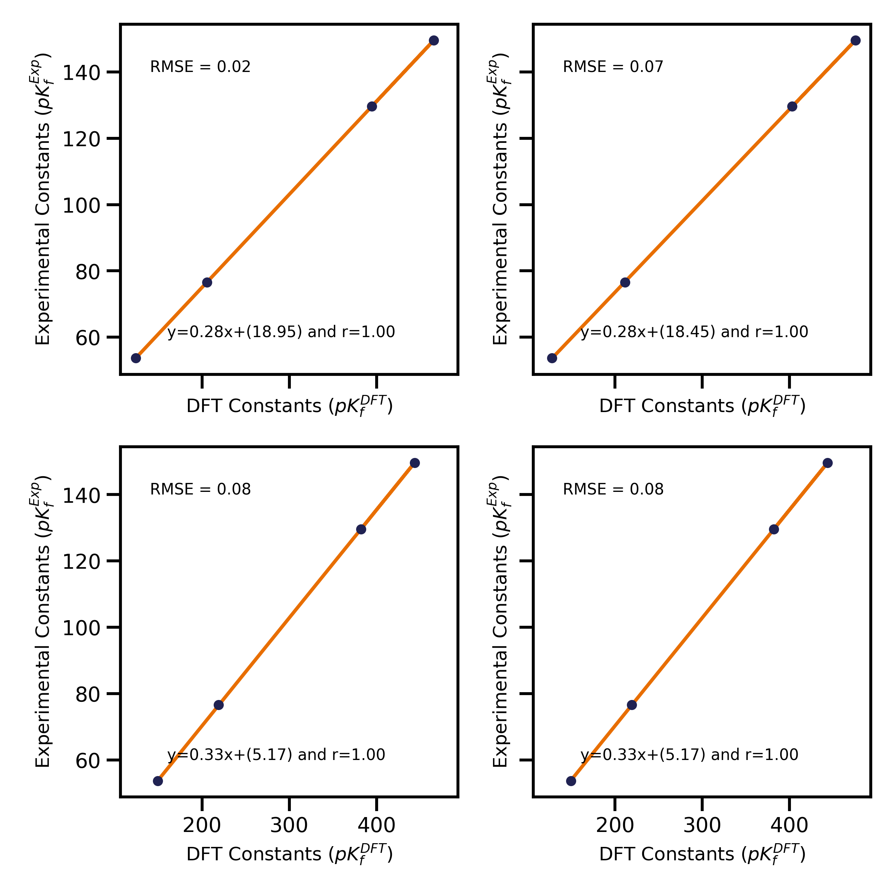

Linear Scaling
====================

Next step is focused on processing the calculated data. We move from the `simulations/` folder, to the
`utilities/` folder. From all speciation models we need to know which one is **the most accurate model**.
To decide it, we need experimental data to compare with the data calculated. In the `modules/DataBase.py`,
experimental data is stored as Python dictionaries. To compare experimental constants to those calculated, the user must
write the experimental data inside a dictionary. In general, POMSimulator works with logarithmic  units, assuming that
all concentrations used to compute the constant are in mol/L. Below we show an example of formation constants:

.. list-table:: Rosantsev_W12_I01_05I
   :header-rows: 1
   :widths: 50 20

   * - Compound
     - Value
   * - W06O22-2H
     - 53.68
   * - W07O24-1H
     - 76.59
   * - W12O42-2H
     - 123.38
   * - W12O40-2H
     - 149.59
   * - W10O32-0H
     - 129.63

Before running ``scale_constants.py``, some parameters should be checked :

- ``metal``: Change into the metal of study
- ``Labels`` : Modify this parameter to the desired Labels, found in `DataBase.py`
- ``ExpDict``: Modify to use the desired set of experimental constants, also found in ``DataBase.py``
- ``lgkf_file``: Modify to use the desired set of calculated constants (This parameter is related to the **Output_File** from the simulation)

Once the user has introduced the experimental data in a dictionary, then it is possible
run the program `scale_constants.py` inside `utilities/`. This program
calculates a linear regression between experimental data and the
simulated one, thus generating the  Root Mean Square Error, **RMSE**, value for
all speciation models. As a result, an output file will be written, containing the scaling
parameters of the best model (``scaling_params.pomsim``). Moreover, the scaling
parameters of each individual speciation model are included in a CSV file (``regresion_output.csv``). Below we depict
the typical linear regressions obtained in POMSimulator:

Next step is to calculate the speciation of the selected model, usually the best one. The **monometal_speciation** will calculate
the concentration of each species at every value of pH. Inside `utilities/`, run: ``monometal_speciation.py``. As usual, we first need to define
some parameters related to the speciation:

- ``formation_labels``: User must define which labels has used to calculate the formation constants
- ``speciation_labels``: It is possible to use only a subset of species to compute the speciation, e.g. leaving out species that are known not to be important along the pH range of interest. User must define which labels wants to use to calculate the speciation.
- ``ref_stoich``: Formation reactions are defined from 1 reference compound, usually the monomer. Specify which compound is your reference, write its stoichiometry as a list (xx,yy,z), as mentioned in **Section 1**
- ``min_pH,max_pH,step_pH``: User must define the pH grid to which the program will solve the speciation. A minimum and maximum value have to be defined, as well as the step value. The finer the pH grid, the better the speciation diagram.
- ``C``: This parameter refers to the initial concentration of the reference compound
- ``batch_size``: As for the calculation of formation constants, the speciation is also batched. Specify the size of the batch.
- ``path``: Write the path to the formation constants file.
- ``path_to_output``: Where the user wants its concentration array to be saved
- ``path_to_params``: Path to the scaling parameters calculated in **scale_constants.py**

The **monometal_phase** will calculate the concentration of each species at every pH value and at different initial concentration values.
Inside `utilities/`, run: `` monometal_phase.py``. For the phase diagram, the same parameters must be filled, but also a new parameter must be considered
instead of **C**:

- ``C_list``: For the phase diagram we need to solve the speciation for different concentration values. In this parameter we can set which concentrations will be used.
