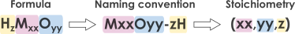

Simulation
================

Design molecular set
--------------------

To start using POMSimulator, it is necessary to design a set of molecules, which then ought to be optimized with a quantum
mechanical software. The choice of the molecular set has a decisive effect on the final speciation and mechanistic results.
Thus, we highly recommend gathering sufficient expertise in the chemical system understudy (e.g., experimental data from mass spectrometry,
nuclear magnetic resonance, infrared, etc) to determine which metal-oxo clusters should be considered. For instance, if a critical molecule for
a given system is not included in the molecular set, then the outcome is likely to be compromised. Another alternative would be
to rely on automated reaction exploration frameworks to build the molecular set and reaction network, even though this option has not been applied so far.

.. note::
   POMSimulator has only been employed with the quantum chemistry calculations performed by Amsterdam Density Functional (ADF), thus
   we recommend using this software. Alternatively, other packages such as ORCA, Gaussian and MOLCAS could also be potentially
   coupled to our method since only reaction energies -hence relative energies- are considered for the simulation.

The files should be named in the following format, **MxxOyy-zH**, indicating the number of atomic elements. Here, M is the metal atom
(and *xx*, its stoichiometry), O is oxygen (and *yy* its stoichiometry) and H, the hydrogen (*z*). Under this
convention, file names can be seamlessly transformed to stoichiometric coefficients, which are employed in multiple
steps of POMSimulator's workflow. The second step entails placing the molecular set inside the
POMSimulator directory. The set of molecules should be placed in the `inputs` directory.

|

Chemical reactions
-------------------

POMSimulator represents chemical data as molecular graphs, where nodes correspond to atoms, and edges to chemical bonds.
ADF offers the possibility of applying the Quantum Theory of Atoms in Molecules (QTAIM) to deduce chemical connectivity from
a topological analysis of the electronic density. While this connectivity works well for organic compounds, it can be miscellaneous
for metal complexes. For this reason, we create a ``.mol`` file for each molecule from an ADF ``.out`` file, and we highly recommend to
manually check the connectivity of all the molecules. After that, the isomorphism property for the molecular set can be computed.
As a result, an isomorphism matrix will be saved as an ``.csv`` file which will be then used in the simulation file. It is worth noting
that it is possible to *skip* the isomorphism check (thus speeding up the process) by only considering stoichiometry-based criteria to
generate the reaction network. Nevertheless, enforcing isomorphism both reduces the size and complexity of the system and enhances the
chemical soundness of the method.

.. warning::

   Defining the chemical bond connectivity of the molecular set is critical, as it will determine the number of chemical reactions in the final network,
   and ultimately the number of speciation models. We encourage checking the ``.mol`` files before running the simulation.

If the isomorphism check is requested, the user should run inside the directory `utilities/`:

1. ``generate_mol_file.py``: Two parameters must be adjusted to the user needs: the adf .out directory
and the directory to store the generated .mol files.

2. ``compute_isomorphism.py``: In this case, only the .mol directory must be used as an input
parameter. The result of this program is the isomorphism matrix, that will be saved as an .csv file named ``np_IM.csv``

After these two programs have been employed, the user can run the simulations. We have prepared a sample file in the `/simulations` directory
under the name of `simulation_tungstates.py`. In this file, some parameters can be modified according to the user's needs.

- ``ADF_folder``: Modify this according to the name of your **molecular set directory**.
- ``mol_folder``: Modify this according to where you keep the mol files, to check **isomorphisms**.
- ``isomorphism_matrix``: Modify this according to the path of the isomorphic matrix generated from the isomorphism.
- ``formation_constants_file``: Modify this according to the name you want to give to the **formation constants** file.
- ``CRN_file``: Modify this according to the name you want to give to the file containing the **chemical reactions**.
- ``simulation_file``: Modify this parameter, to name the file which will contain all the simulation details.
- ``use_isomorphism``: Modify this boolean value to fit whether User want to apply **isomorphism** or not
- ``cores``: The number of **cores** to which the program will parallelize the resolution of speciation models.
- ``batch_size``: speciation models are solved in batches. This parameter defines **how many models** each batch will have. Modify this parameter to fit your needs, and hardware specifications.
- ``ref_compound``: which compound is the user's reference in the chemical set.
- ``I``: Ionic strength.
- ``C0``: Initial concentration of reference compound.
- ``min_pH,max_pH,grid``: pH grid of values for the simulation to solve the equilibrium equations.

Then, the user needs to select which chemical reactions should be included in the simulation. This is achieved by modifying the
``reference`` variable. A brief definition of all the possible reaction types and how they are located is summarised in the following table:

.. list-table::
   :header-rows: 1
   :widths: 10 20 70 20

   * - Reaction type
     - Full name
     - Description
     - Stoich diff.
       ( P - R ) [xM,yO,zH]
   * - P
     - Protonation
     - R\ :sub:`1` + H\ :sup:`+` → P
     - [0,0,1]
   * - H2Ow1
     - 1 water Hydration
     - R\ :sub:`1` + H\ :sub:`2`\ O → P
     - [0,1,2]
   * - H2Ow2
     - 2 water Hydration
     - R\ :sub:`1` + 2 H\ :sub:`2`\ O → P
     - [0,2,4]
   * - Cw1
     - 1 water Condensation
     - R\ :sub:`1` + R\ :sub:`2` → P + H\ :sub:`2`\ O
     - [0,-1,-2]
   * - Cw2
     - 2 water Condensation
     - R\ :sub:`1` + R\ :sub:`2` → P + 2 H\ :sub:`2`\ O
     - [0,-2,-4]
   * - Cw3
     - 3 water Condensation
     - R\ :sub:`1` + R\ :sub:`2` → P + 3 H\ :sub:`2`\ O
     - [0,-3,-6]
   * - Cw4
     - 4 water Condensation
     - R\ :sub:`1` + R\ :sub:`2` → P + 4 H\ :sub:`2`\ O
     - [0,-4,-8]
   * - Cw10
     - 10 water Condensation
     - R\ :sub:`1` + R\ :sub:`2` → P + 10 H\ :sub:`2`\ O
     - [0,-10,-20]
   * - A
     - Addition
     - R\ :sub:`1` + R\ :sub:`2` → P
     - [0,0,0]
   * - HO
     - Hydroxylation
     - R\ :sub:`1` + H\ :sub:`6`\ O\ :sub:`3` → P +  [H\ :sub:`5`\ O\ :sub:`2`]\ :sup:`+`
     - [0,1,1]
   * - H3O
     - Acid Hydrolysis
     - R\ :sub:`1` + H\ :sub:`3`\ O\ :sup:`+` → P
     - [0,1,3]

.. note::

   The release 1.0 does not consider redox reactions, even though polyoxometalates are frequently employed in the field of catalysis
   and energy materials. We shall consider adding this functionality in future versions of the package.

Multi-species chemical equilibria
----------------------------------

The number of speciation models grows factorially as function of the number of reactions and chemical species.
To mitigate this growth, some chemical constrains can be applied, as described below:

- ``energy_threshold``: Only reactions with energies below this number (in kcal/mol) will be considered.
- ``proton_numb``: Species can be found in different protonation states, but only species with similar protonation states can be found in the same pH ranges.
- ``restrain_addition``: This parameter restrains addition reactions, only allowing these where one of the reagents has as many (or less) atoms as marked by this parameter (e.g., if set to 1, only additions where one reagent is a monomer). An integer value is expected.
- ``restrain_condensations``: This parameter restrains condensation reactions, only allowing these where one of the reagents has as many (or less) atoms as marked by this parameter (e.g., if set to 1, only condensations where one reagent is a monomer). An integer value is expected.
- ``include_dimerization``: This parameter allows dimerization reactions to occur, even if additions and/or condensations have been restricted. A boolean `True` or `False` is expected.
- ``force_stoich``: This parameter allows reactions that generate species with a certain number of metal atoms, even if they do not fulfill any of the previous conditions. A list of integer values is expected.
- ``adjust_protons_hydration``: This parameter takes into account the number of protons present in water molecules in hydrated species. If True, these will be ignored them when computing proton balance, to fulfill `proton_numb` condition.

.. attention::

   These simulation parameters are key to constrain the factorial growth of the number of models. We are currently working in a new approach
   in which an stochastic sampling of the speciation space will be carried out.

Once the parameters fit the user's needs, the simulation is ready to run. The simulation will write the output file, containing all the formation constants
for all the speciation models. This file will be named according to the ``Output_File`` parameter mentioned above. Also, a file
with all the parameters used in the simulation will be written named as `simulation_parameters.txt`.
